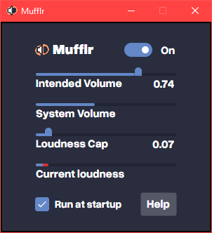

Mufflr
======

Mufflr's aim is to protect your ears when you're using your computer. It is a little tool for Windows that automatically turns down the system volume whenever something loud starts playing, before you even hear it.

It was initially created for video games (specifically Counter-Strike) to avoid getting tinnitus. You need the volume up high enough to hear footsteps, but then shooting sounds are far too loud to be comfortable. Mufflr allows you to listen to quiet audio at your preferred volume, but as soon as any loud audio starts the volume is instantly reduced to avoid any hearing damage.

Download and run
----------------

See the [Releases section](https://github.com/johntringham/Mufflr/releases) for latest version, then run the .exe. It doesn't need to be installed. You might get a Microsoft security popup, just ignore it and hit "run anyway".

Mufflr will then open the settings window. Set a loudness cap, and it'll start running.

Building
--------

To build locally, download the source code and open `Mufflr.sln` with Visual Studio 2022, and then hit build.

Alternatively, run `publish.bat`. The resultant exe will be found at `\Mufflr.Desktop\bin\Release\net8.0-windows10.0.17763.0\win-x64\publish\Mufflr.Desktop.exe`.

How it works
------------

Mufflr uses [NAudio](https://github.com/naudio/NAudio) to get the current audio device and the audio that is being played out of it. It then computes the current amplitude (loudness) of the audio being played. If the the amplitude is greater than the user-configured "loudness cap", the Windows system volume is instantly reduced so that the audio is played at an acceptable level. As soon as the audio stops being loud, the system volume is quickly returned to normal levels.

If you change the system volume manually (using keyboard shortcuts or via Windows controls), Mufflr will be temporarily disabled for a short time (2 seconds). This is just so Mufflr and you aren't both trying to change the system volume at the same time.

Mufflr intends to reduce the chance of getting hearing damage from using a computer, but makes no guarantee about that. You should still be sensible - don't turn everything up to max volume and rely solely on Mufflr to not go deaf.

Credits
-------

Made by [John Tringham](https://blog.seedganggames.com/) using [Avalonia](https://avaloniaui.net/) and [NAudio](https://github.com/naudio/NAudio).

This program is free and open source, and does no tracking, telemetry, or data collection.

Licence
-------

You can do what you want with this and its source code, as long as it is correctly and visibly credited.

